# 🌎 Global E-Commerce Sales Analytics | Tableau

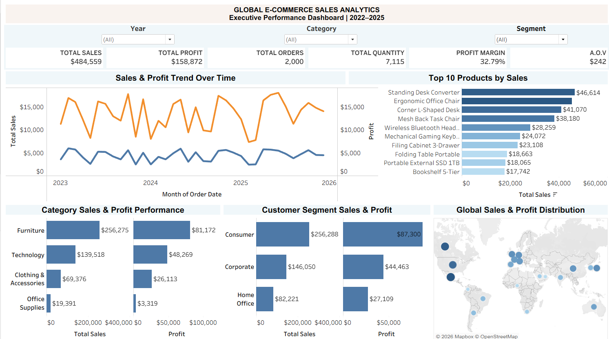

## 📊 Project Overview

An end-to-end **Global E-Commerce Sales Analytics project** developed in Tableau to evaluate sales performance, profitability, customer segments, products, regions, geographic distribution, and discount impact.

The project transforms raw e-commerce transaction data into an interactive business intelligence solution designed to answer practical business questions such as:

- How are sales and profit changing over time?
- Which products generate the highest sales?
- Which categories and customer segments contribute the most revenue and profit?
- Which regions perform best?
- How are sales distributed geographically?
- What is the relationship between discount levels and profitability?

The analysis focuses on converting transactional data into **clear KPIs, visual trends, comparative analysis, and actionable business insights.**

---

## 🎯 Business Objectives

The primary objectives of this project were to:

1. Measure overall sales and profitability.
2. Track sales and profit trends over time.
3. Identify top-performing products.
4. Compare product category performance.
5. Evaluate customer segment contribution.
6. Analyze regional sales and profit performance.
7. Understand global geographic distribution.
8. Examine the relationship between discounts and profit margins.
9. Build an executive-style dashboard for faster business decision-making.

---

## 🛠️ Tools & Technologies

| Tool | Purpose |
|---|---|
| **Tableau** | Data visualization, dashboard development and business analysis |
| **Microsoft Excel** | Data preparation and supporting analysis |
| **Kaggle** | Dataset source |
| **GitHub** | Project documentation and portfolio presentation |

### Tableau Skills Demonstrated

- Data visualization
- Dashboard development
- KPI design
- Calculated fields
- Filters and interactive controls
- Time-series analysis
- Geographic mapping
- Comparative analysis
- Profitability analysis
- Scatter/bubble visualization
- Business storytelling

---

# 📈 Executive Dashboard


### Key Performance Indicators

| KPI | Result |
|---|---:|
| 💰 **Total Sales** | **$484,559** |
| 📈 **Total Profit** | **$158,872** |
| 🛒 **Total Orders** | **2,000** |
| 📦 **Total Quantity** | **7,115** |
| 📊 **Profit Margin** | **32.79%** |
| 💵 **Average Order Value** | **$242** |

The dashboard combines KPI cards, time-series analysis, product rankings, category performance, customer segments and geographic distribution into a single executive view.

---

# 🔍 Analysis & Visualizations

## 1. Sales & Profit Trend Over Time


This analysis tracks monthly sales and profit performance across the available period.

### Key Takeaways

- Sales and profit show noticeable month-to-month variation.
- Several periods demonstrate strong simultaneous sales and profit performance.
- The visualization helps identify periods of growth, decline and volatility.
- Monitoring both sales and profit together provides a better view of business performance than revenue alone.

---

## 2. Top 10 Products by Sales

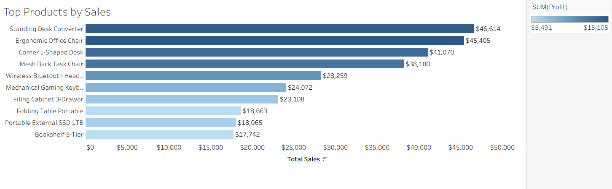

### Top-performing products include:

1. **Standing Desk Converter** — $46,614
2. **Ergonomic Office Chair** — $45,405
3. **Corner L-Shaped Desk** — $41,070
4. **Mesh Back Task Chair** — $38,180
5. **Wireless Bluetooth Headset** — $28,259
6. **Mechanical Gaming Keyboard** — $24,072
7. **Filing Cabinet 3-Drawer** — $23,108
8. **Folding Table Portable** — $18,663
9. **Portable External SSD 1TB** — $18,065
10. **Bookshelf 5-Tier** — $17,742

### Business Insight

Office furniture products dominate the top positions, with the **Standing Desk Converter** generating the highest sales among the analyzed products.

---

## 3. Sales & Profit by Product Category

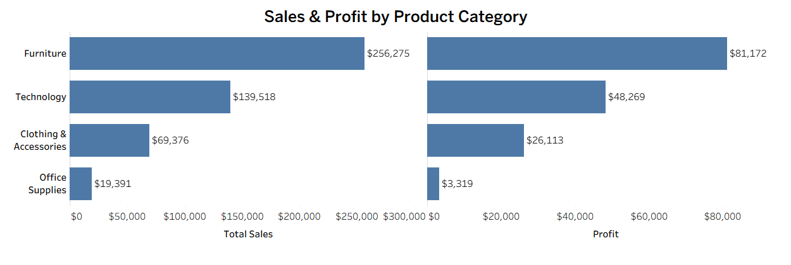

### Category Performance

| Category | Sales | Profit |
|---|---:|---:|
| **Furniture** | $256,275 | $81,172 |
| **Technology** | $139,518 | $48,269 |
| **Clothing & Accessories** | $69,376 | $26,113 |
| **Office Supplies** | $19,391 | $3,319 |

### Key Insight

**Furniture** is the strongest-performing category in both sales and profit, while **Office Supplies** contributes the lowest sales and profit among the four categories.

---

## 4. Customer Segment Performance

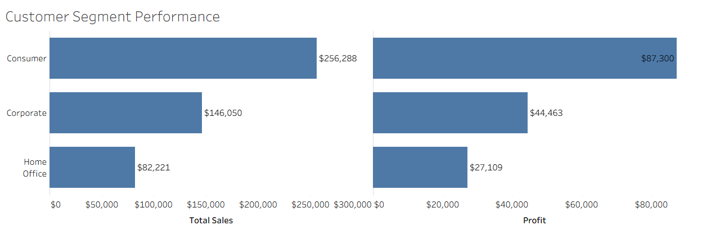

### Segment Performance

| Customer Segment | Sales | Profit |
|---|---:|---:|
| **Consumer** | $256,288 | $87,300 |
| **Corporate** | $146,050 | $44,463 |
| **Home Office** | $82,221 | $27,109 |

### Key Insight

The **Consumer segment** is the largest contributor to both sales and profit, making it the most important customer segment in the analyzed dataset.

---

## 5. Regional Performance

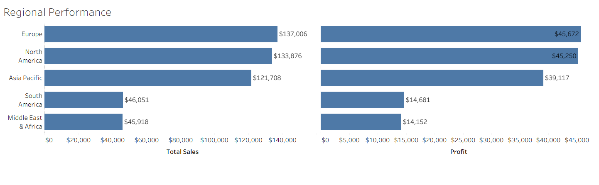

### Regional Results

| Region | Sales | Profit |
|---|---:|---:|
| **Europe** | $137,006 | $45,672 |
| **North America** | $133,876 | $45,250 |
| **Asia Pacific** | $121,708 | $39,117 |
| **South America** | $46,051 | $14,681 |
| **Middle East & Africa** | $45,918 | $14,152 |

### Key Insight

**Europe** records the highest sales and profit among the analyzed regions, closely followed by **North America**.

The relatively close performance of the top three regions indicates that the business has a diversified international sales footprint.

---

## 6. Geographic Sales & Profit Distribution

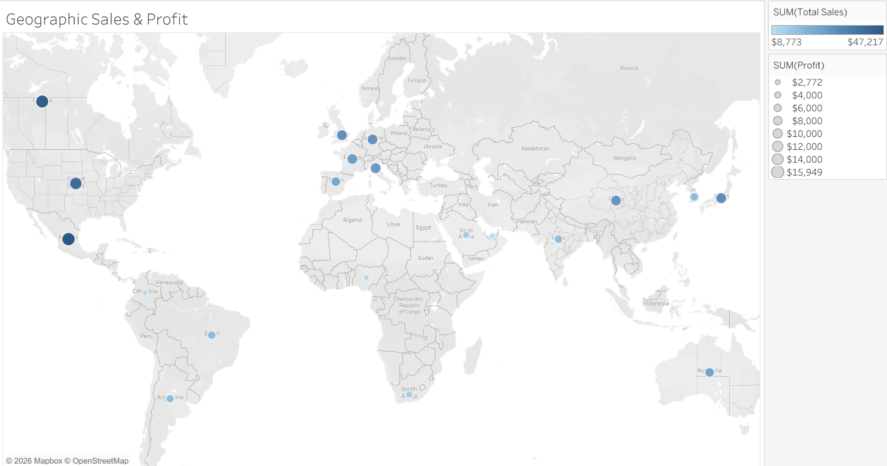

The geographic visualization maps sales and profit performance across countries.

### Purpose

- Identify geographically strong markets.
- Compare market-level sales performance.
- Visualize the international reach of the business.
- Support regional and country-level business analysis.

The map provides a visual layer to complement the regional performance analysis.

---

## 7. Discount vs Profitability


This analysis examines the relationship between **discount percentage and profit margin**.

### Key Observation

The visualization shows that profitability varies considerably across discount levels, including several observations with negative profit margins.

This highlights the importance of monitoring discounting strategies because aggressive discounts can potentially reduce profitability.

> **Note:** The visualization identifies an observed relationship in the dataset; it does not establish that discounting alone causes lower profitability.

---

# 💡 Key Business Insights

### 1. Furniture is the leading category
Furniture generates the highest sales and profit, making it the strongest product category in the analyzed dataset.

### 2. Consumers are the largest customer segment
The Consumer segment contributes the highest sales and profit compared with Corporate and Home Office customers.

### 3. Europe leads regional performance
Europe has the highest regional sales and profit, with North America performing very closely behind.

### 4. Office furniture dominates top products
Several of the highest-selling products are desks, chairs and other office-related products.

### 5. Sales performance fluctuates over time
The monthly trend shows considerable variation, indicating that performance is not constant throughout the analyzed period.

### 6. Discounting requires profitability monitoring
Several high-discount observations show weak or negative profit margins, emphasizing the need to balance promotional strategies with profitability.

---

# 📌 Dashboard KPIs

## Total Sales

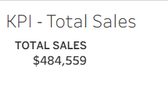

**$484,559**

---

## Total Profit

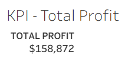

**$158,872**

---

## Total Orders

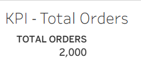

**2,000**

---

## Total Quantity

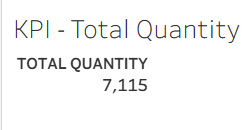

**7,115**

---

## Profit Margin

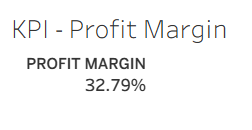

**32.79%**

---

## Average Order Value

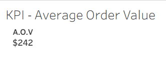

**$242**

---

# 🧠 Analytical Approach

The project followed a structured analytics workflow:

### 1. Data Preparation
- Reviewed the raw e-commerce dataset.
- Prepared the data for analysis.
- Checked relevant dimensions and measures.

### 2. KPI Development
Created business-focused KPIs including:

- Total Sales
- Total Profit
- Total Orders
- Total Quantity
- Profit Margin
- Average Order Value

### 3. Exploratory Analysis
Analyzed:

- Time trends
- Products
- Categories
- Customer segments
- Regions
- Countries
- Discounts
- Profitability

### 4. Visualization
Built multiple Tableau visualizations including:

- KPI cards
- Line charts
- Horizontal bar charts
- Geographic maps
- Scatter/bubble analysis
- Comparative performance charts

### 5. Dashboard Development
Combined the most important business metrics and visualizations into an executive-style dashboard.

---

# 📂 Project Structure

```text
Global-Ecommerce-Analytics/
│
├── screenshots/
│   ├── dashboard.png
│   ├── kpi_01_total_sales.png
│   ├── kpi_02_total_profit.png
│   ├── kpi_03_total_orders.png
│   ├── kpi_04_total_quantity.png
│   ├── kpi_05_profit_margin.png
│   ├── kpi_06_average_order_value.png
│   ├── sales_&_profit_trend_analysis.png
│   ├── top_product_analysis.png
│   ├── category_analysis.png
│   ├── customer_segment_analysis.png
│   ├── regional_analysis.png
│   ├── geographic_analysis.png
│   └── discount VS profitability_analysis.png
│
├── Global_Ecommerce_Analytics.twbx
├── Global_Ecommerce_Analytics.xlsx
```
└── README.md

## 📌 Project Highlights

- Built an executive-style e-commerce analytics dashboard in Tableau
- Analyzed **$484K+ in sales** and **$158K+ in profit**
- Created **6 business-focused KPIs**
- Analyzed product, category, customer segment, regional and geographic performance
- Evaluated the relationship between discounts and profitability
- Designed visualizations to support business decision-making

---

## 👨‍💻 Author

**Naman Gaur**

B.Com (Hons) – Finance | Data Analytics | Business Analytics

**Skills:** Excel • SQL • Power BI • Tableau

---

### 🔎 Skills & Technologies

`Tableau`, `Data Analytics`, `Business Intelligence`, `Data Visualization`, `E-Commerce Analytics`, `Sales Analytics`, `Profitability Analysis`, `Dashboard Development`, `KPI Analysis`, `Business Analysis`.
